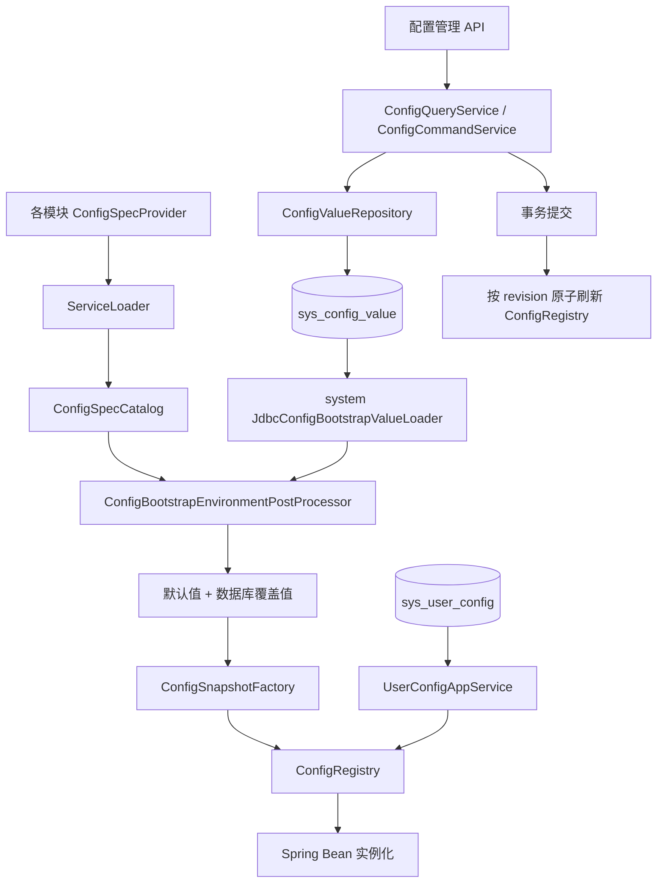

# Breezy 单机应用统一配置管理重构方案

> 适用范围：Breezy 后端单机部署应用  
> 技术栈：Java 21、Spring Boot 3.5.x、JPA、JDBC、Jackson  
> 方案版本：2.0  
> 方案状态：已完成设计，等待按任务顺序实施

---

## 一、需求背景

当前配置体系以单字段作为最小单位，一个字段对应一条 `sys_config` 记录和一个分类型内存缓存项。例如密码策略被拆分为最小长度、数字要求、字母要求、大小写要求等多条配置。

随着配置数量和结构复杂度增加，当前方案出现以下问题：

1. 同一业务规则被拆成多条记录，查询、编辑和发布无法形成完整业务单元。
2. 多字段更新不能保证业务视角下的原子性，运行代码可能读到新旧字段混合状态。
3. 默认值、定义、数据库种子、校验器和前端编辑逻辑分散在多个位置。
4. `INT`、`LONG`、`BOOL`、`STR` 等多套缓存无法表达结构化配置。
5. 复杂 JSON 被当作字符串处理，前后端均需要按配置 code 编写特殊分支。
6. 数据库更新发生在事务提交前就可能刷新内存，事务回滚时会造成数据库与内存不一致。
7. 当前敏感配置缺少统一脱敏和更新语义。
8. 配置数量增加后，现有管理接口的全量查询、内存筛选和分页方式难以继续扩展。

本次从头重构配置体系，不兼容旧 `sys_config` 数据和旧字段级配置 API。重构期间允许后端暂时无法编译或运行，但每个开发任务完成时必须恢复可编译状态。

---

## 二、当前现状

### 2.1 当前代码分布

框架配置能力位于：

```text
com.corwin.framework.config
```

主要包含：

- `ConfigDefinition`、`ConfigDefinitionProvider`、`ConfigDefinitionCatalog`
- `ConfigRegistry`、`ConfigValueParser`
- `ConfigStore`、`StoredConfig`
- `DefaultConfigKeys`
- `DatabaseConfigRegistryEnvironmentPostProcessor`

系统配置管理位于：

```text
com.corwin.system.config
```

主要包含：

- `SystemConfigKeys`
- `Config` 实体与 JPA Repository
- `JpaConfigStore`
- `ConfigAdminService`
- 配置管理 Controller、Req、Res、View 和校验器

业务配置定义集中位于：

```text
com.corwin.config
```

该包同时管理 JSONFMT 和 SchemaForge 配置，缺少业务域自治边界。

### 2.2 当前公共配置

当前配置大致分为：

- framework：业务时间模拟、客户端 IP、鉴权白名单、日志过滤路径、用户偏好默认值。
- system：认证、密码策略、审计、文件存储、SSE、Web Push、消息类型配置。
- business：JSONFMT 文件阈值、SchemaForge DDL 格式和限定符模式。

### 2.3 当前用户个性化配置

用户个性化配置使用独立的 `sys_user_config` 保存用户覆盖值，目前包括：

- `USER_TIME_ZONE`
- `USER_DATE_TIME_FORMAT`
- `USER_DATE_FORMAT`
- `USER_DECIMAL_FORMAT`

这些配置同时存在系统默认值和用户覆盖值，最终值遵循：

```text
用户覆盖值 > 公共配置注册表中的用户偏好默认值
```

用户覆盖值不进入公共配置注册表，但用户偏好默认值属于公共配置资源，继续通过统一配置管理功能维护。

---

## 三、设计目标

### 3.1 核心目标

1. 从“单字段配置项”升级为“业务配置资源”。
2. 一个配置资源一起查询、编辑、校验、持久化和生效。
3. 配置值使用不可变 Java 对象，优先使用 `record`。
4. 每个配置资源必须在代码中提供安全默认值。
5. `sys_config_value` 没有记录时直接使用代码默认值。
6. 数据库只保存管理员覆盖值或重置状态标记，不自动复制代码默认值。
7. 配置定义由各模块自行提供，框架统一发现和注册。
8. 应用 Bean 实例化前完成配置定义发现、数据库覆盖值加载和注册表初始化。
9. 配置更新必须先解析和校验，再持久化，事务提交后刷新内存。
10. 内存以完整配置资源为单位原子替换。
11. 支持动态生效和重启生效两种策略。
12. 支持统一动态表单元数据，复杂配置允许专用编辑器。
13. 用户偏好默认值通过公共配置注册表管理。
14. 权限只区分查看和编辑，不增加配置资源级权限。
15. 仅支持单机部署，不实现跨实例同步。

### 3.2 非目标

本期不实现：

- 旧配置表和旧配置 code 的兼容。
- 历史版本、回滚和审批。
- 多环境、多租户和灰度配置。
- 分布式配置同步。
- 用户个性化配置结构重构。
- 完整 JSON Schema 引擎。
- 配置资源级细粒度权限。
- 数据库敏感字段加密框架。

### 3.3 已确认决策

1. 拥有 `cfg.edit` 权限即可编辑任意可编辑配置资源。
2. `cfg.view` 用于配置列表和详情查询。
3. 用户个性化配置继续使用独立用户覆盖表。
4. 用户个性化默认值由公共配置资源统一管理。
5. 数据库只保存管理员覆盖值或重置状态标记。
6. 重置默认值保留 `configured=false` 状态并递增 revision，运行值始终读取当前代码默认值。
7. 不自动向数据库补齐代码默认值记录。
8. 不保留原有 `INT`、`BOOL`、`STR` 等分类型缓存和读取 API。

---

## 四、核心设计原则

### 4.1 配置资源是最小管理单元

满足以下任一条件的字段应放入同一配置资源：

- 一般由管理员一起修改。
- 存在跨字段校验。
- 业务读取时必须看到同一版本。
- 应使用同一个管理表单。
- 应一起生效。

示例：

| 配置资源 | 字段示例 |
| --- | --- |
| 密码策略 | 最小长度、数字、字母、大小写、特殊字符、强制修改 |
| 审计策略 | 是否启用、是否异步、请求摘要长度、响应摘要长度 |
| Web Push | 公钥、私钥、主题 |
| 客户端 IP | 解析模式、可信代理头、代理层数 |
| 用户偏好默认值 | 时区、日期时间格式、日期格式、小数格式 |

### 4.2 代码是定义和默认值的唯一事实来源

代码负责：

- 配置键。
- 模块和分组。
- 标题和说明。
- Java 类型。
- 默认值。
- schema 版本。
- 编辑策略和生效策略。
- 敏感字段声明。
- 字段元数据。
- 运行时校验和发布校验。

数据库只负责：

- 完整 JSON 覆盖值。
- schema 版本。
- revision。
- 是否存在管理员覆盖值。
- 修改人和修改时间。
- 修改原因。

数据库没有记录不是异常，而是明确表示当前使用代码默认值。

### 4.3 默认值必须安全可运行

默认值必须：

1. 非空。
2. 能够序列化和反序列化。
3. 通过 Runtime 校验。
4. 不会导致空指针或类型错误。
5. 不自动开启依赖外部密钥、证书或第三方服务的能力。
6. 不包含真实密码、Token、私钥或 API Key。
7. 允许系统启动、管理员登录和进入配置管理页面。

### 4.4 读取无锁，更新原子

运行代码通过强类型定义读取完整对象：

```java
PasswordPolicyConfig policy = Configs.get(SystemConfigSpecs.PASSWORD_POLICY);
```

单次业务操作开始时读取一次配置对象，并在该操作内复用。不得长期持有需要动态更新的配置对象引用。

### 4.5 数据库缺失与数据库不可用必须区分

- 数据库连接正常但配置记录缺失：使用代码默认值。
- 配置表存在但为空：所有资源使用代码默认值。
- 配置表不存在：视为 schema 未初始化，正常应用启动失败，并提示先执行 bootstrap。
- 数据库无法连接：正常应用启动失败。
- 单条数据库配置损坏：按配置定义的失败策略处理。

---

## 五、总体架构



职责划分：

1. 配置定义层：各模块定义类型、默认值、元数据和校验规则。
2. 配置发现层：framework 通过 `ServiceLoader` 汇总全部定义。
3. 启动加载层：framework 编排启动加载，system 提供 JDBC 数据库读取实现。
4. 运行时层：framework 保存不可变快照并提供强类型读取。
5. 配置管理层：system 提供查询、校验、更新和重置用例。
6. 用户偏好层：system 用户服务合并公共默认值和用户覆盖值。

---

## 六、模块与包结构

### 6.1 framework

```text
com.corwin.framework.config
├─ definition
│  ├─ ConfigKey.java
│  ├─ ConfigSpec.java
│  ├─ ConfigSpecProvider.java
│  ├─ ConfigSpecCatalog.java
│  ├─ ConfigFieldSpec.java
│  ├─ ConfigFieldType.java
│  ├─ ConfigOptionItem.java
│  ├─ ConfigActivationPolicy.java
│  ├─ ConfigEditPolicy.java
│  ├─ ConfigInvalidValuePolicy.java
│  └─ ConfigViolation.java
├─ runtime
│  ├─ ConfigRegistry.java
│  ├─ ConfigSnapshot.java
│  ├─ ConfigValueSource.java
│  ├─ Configs.java
│  └─ ConfigSnapshotFactory.java
├─ bootstrap
│  ├─ ConfigBootstrapValueLoader.java
│  ├─ RawConfigValue.java
│  └─ ConfigBootstrapEnvironmentPostProcessor.java
├─ codec
│  └─ ConfigJsonCodec.java
└─ error
   ├─ ConfigDefinitionException.java
   ├─ ConfigValidationException.java
   ├─ MissingConfigException.java
   └─ ConfigLoadException.java
```

framework 不得：

- 依赖 `com.corwin.system` 或任意业务域包。
- 硬编码 `sys_config_value` 表名和 SQL。
- 包含密码策略、审计策略等业务定义。
- 依赖 JPA 实体或 Repository。

### 6.2 system 配置管理

```text
com.corwin.system.config
├─ application
│  ├─ command
│  ├─ service
│  │  ├─ ConfigQueryService.java
│  │  └─ ConfigCommandService.java
│  └─ view
├─ domain
│  ├─ model
│  │  └─ ConfigValue.java
│  └─ repo
│     └─ ConfigValueRepository.java
├─ infrastructure
│  ├─ bootstrap
│  │  └─ JdbcConfigBootstrapValueLoader.java
│  └─ persistence
│     ├─ ConfigValueEntity.java
│     ├─ ConfigValueJpaRepository.java
│     └─ ConfigValueRepositoryJpaAdapter.java
└─ interfaces.web
   ├─ ConfigController.java
   ├─ req
   └─ res
```

### 6.3 配置定义归属

配置定义应放在实际消费它的领域中，不再使用全局 `com.corwin.config` 聚合所有业务配置。

建议：

```text
com.corwin.framework.web.config
com.corwin.system.auth.config
com.corwin.system.audit.config
com.corwin.system.file.config
com.corwin.system.notify.config
com.corwin.system.user.config
com.corwin.jsonfmt.config
com.corwin.schemaforge.config
```

每个 Maven 模块可以使用一个 Provider 汇总本模块 ConfigSpec，也可以由各领域分别提供 Provider。

---

## 七、配置键模型

### 7.1 ConfigKey

配置键使用稳定规范字符串，不使用 Java 类全限定名，也不使用会随业务扩展而变化的 `ConfigOwner` 枚举。

```java
public record ConfigKey(String value) {

    private static final Pattern PATTERN = Pattern.compile(
            "[a-z][a-z0-9]*(\\.[a-z][a-z0-9-]*)+"
    );

    public ConfigKey {
        if (value == null || !PATTERN.matcher(value).matches()) {
            throw new IllegalArgumentException("Invalid config key: " + value);
        }
    }
}
```

示例：

```text
framework.web.client-ip
framework.web.logging-filter
system.security.password-policy
system.audit.policy
system.user.preference-defaults
system.notify.web-push
jsonfmt.storage.policy
schemaforge.ddl.policy
```

要求：

- 全局唯一。
- 发布后保持稳定。
- 不自动转换大小写或下划线，避免隐式碰撞。
- `module` 和 `group` 作为展示元数据，不参与 key 解析。

---

## 八、配置定义模型

### 8.1 ConfigSpec

```java
public interface ConfigSpec<T> {

    ConfigKey key();

    String module();

    String group();

    String title();

    String description();

    Class<T> valueClass();

    T defaultValue();

    int schemaVersion();

    int order();

    ConfigActivationPolicy activationPolicy();

    ConfigEditPolicy editPolicy();

    ConfigInvalidValuePolicy invalidValuePolicy();

    List<ConfigFieldSpec> fields();

    default String editorId() {
        return "default";
    }

    List<ConfigViolation> validateRuntime(T value);

    List<ConfigViolation> validatePublish(T value);
}
```

说明：

- 第一阶段配置值必须使用具体对象类型，不直接使用顶层 `Map` 或泛型集合。
- 复杂集合应封装在具体 `record` 中，因此 `Class<T>` 足够表达反序列化类型。
- `defaultValue` 及其嵌套集合必须不可变。
- `order` 用于后台稳定排序。
- `editorId` 只用于复杂配置选择专用编辑器，不能替代服务端校验。

### 8.2 生效策略

```java
public enum ConfigActivationPolicy {
    DYNAMIC,
    RESTART_REQUIRED
}
```

- `DYNAMIC`：事务提交后立即替换运行时快照。
- `RESTART_REQUIRED`：只更新数据库，当前运行值保持不变，重启后加载新值。

### 8.3 编辑策略

```java
public enum ConfigEditPolicy {
    ADMIN_EDITABLE,
    READ_ONLY
}
```

- `ADMIN_EDITABLE`：拥有 `cfg.edit` 权限即可编辑。
- `READ_ONLY`：后台可以查看，但不能修改。

### 8.4 非法值策略

```java
public enum ConfigInvalidValuePolicy {
    USE_DEFAULT,
    FAIL_STARTUP
}
```

- 普通非关键配置可以选择 `USE_DEFAULT`。
- 鉴权、安全、核心存储等配置应根据风险选择 `FAIL_STARTUP`。

### 8.5 两级校验

Runtime 校验用于判断配置是否能安全参与系统运行。

Publish 校验用于管理员发布时执行完整业务校验，例如：

- 密码最小长度必须处于业务范围。
- 开启大写或小写要求时必须启用字母要求。
- 开启 Web Push 时必须具备完整密钥和主题。
- 审计摘要长度必须大于零。

校验返回字段级错误：

```java
public record ConfigViolation(
        String path,
        String code,
        String message
) {
}
```

### 8.6 字段元数据

```java
public record ConfigFieldSpec(
        String path,
        String title,
        String description,
        ConfigFieldType type,
        boolean required,
        boolean sensitive,
        boolean readOnly,
        int order,
        String placeholder,
        BigDecimal min,
        BigDecimal max,
        Integer minLength,
        Integer maxLength,
        List<ConfigOptionItem> options
) {
}
```

第一阶段通用表单支持：

- 字符串、整数、长整数、小数、布尔值。
- 枚举单选。
- 简单 `List<String>`。
- 简单嵌套对象路径。

对象数组、动态 Map、复杂条件交互使用专用 `editorId`。

---

## 九、配置发现

### 9.1 Provider

```java
public interface ConfigSpecProvider {
    Collection<ConfigSpec<?>> getConfigSpecs();
}
```

各模块通过以下 SPI 文件注册：

```text
META-INF/services/com.corwin.framework.config.definition.ConfigSpecProvider
```

### 9.2 Catalog 校验

启动时必须校验：

- 至少发现一个 Provider 和一个 ConfigSpec。
- Provider 和返回集合不为 null。
- 配置键合法且不重复。
- 默认值非空且类型正确。
- 默认值能够完成 JSON 序列化和反序列化。
- 默认值通过 Runtime 校验。
- schema version 大于零。
- 字段 path 合法且不重复。
- 敏感字段的代码默认值不包含真实秘密。

配置定义错误属于程序缺陷，必须中止启动。

Catalog 输出按以下字段稳定排序：

```text
module -> group -> order -> key
```

---

## 十、数据库设计

### 10.1 当前值表

新表名：

```text
sys_config_value
```

逻辑结构：

```sql
create table sys_config_value
(
    config_key      varchar(160) primary key,
    content         text         not null,
    schema_version  integer      not null,
    revision        bigint       not null,
    configured      boolean      not null,
    updated_by      bigint,
    updated_at      timestamp    not null,
    update_reason   varchar(500)
);
```

具体 MySQL 和 PostgreSQL 类型按现有 bootstrap schema 风格分别定义。

不使用物理外键。

### 10.2 不保存的字段

数据库不保存：

- 标题和描述。
- Java 类型。
- module、group 和 order。
- 默认值。
- 字段元数据。
- 校验规则。
- 编辑策略和生效策略。
- 敏感标记。
- enabled。

`configured` 只用于区分管理员覆盖值和重置状态，不用于保存或同步代码默认值：

- 无数据库记录：从未保存，使用代码默认值，revision 为 0。
- `configured=true`：解析并使用数据库覆盖值。
- `configured=false`：忽略数据库 content，使用当前代码默认值，但保留单调递增的 revision。

### 10.3 revision 规则

- 数据库无记录：revision 为 0。
- 首次保存：expectedRevision 必须为 0，插入后 revision 为 1。
- 后续更新：按 expectedRevision 执行乐观锁更新，revision 加 1。
- 重置默认值：按 expectedRevision 将 `configured=false` 并让 revision 加 1，运行值切换为当前代码默认值。
- 重置后的再次保存：更新同一记录、设置 `configured=true` 并继续递增 revision。

### 10.4 schema 同步

实体变更必须同步：

```text
server/bootstrap/src/main/resources/bootstarp/sql/mysql/system_schema.sql
server/bootstrap/src/main/resources/bootstarp/sql/pgsql/system_schema.sql
```

旧 `sys_config` 及其配置同步 SQL、默认值种子逻辑直接删除，不做数据迁移。

---

## 十一、运行时模型

### 11.1 值来源

```java
public enum ConfigValueSource {
    CODE_DEFAULT,
    DATABASE_OVERRIDE,
    INVALID_DATABASE_FALLBACK
}
```

### 11.2 快照

```java
public record ConfigSnapshot<T>(
        ConfigKey key,
        T value,
        long revision,
        int schemaVersion,
        ConfigValueSource source,
        Instant loadedAt,
        String loadWarning
) {
}
```

快照只表达当前运行时有效值。对于 `RESTART_REQUIRED` 配置，数据库待生效值由管理查询模型单独返回，不提前写入运行快照。

### 11.3 注册表

```java
public final class ConfigRegistry {

    private static final AtomicReference<Map<String, ConfigSnapshot<?>>> CURRENT =
            new AtomicReference<>(Map.of());

    public static void initialize(Map<String, ConfigSnapshot<?>> snapshots) {
        CURRENT.set(Map.copyOf(snapshots));
    }

    public static <T> T get(ConfigSpec<T> spec) {
        return snapshot(spec).value();
    }

    public static <T> ConfigSnapshot<T> snapshot(ConfigSpec<T> spec) {
        // 根据同一个 ConfigSpec 完成受控类型转换
    }

    static void replaceIfNewer(ConfigSnapshot<?> snapshot) {
        // 仅允许 revision 更高的快照覆盖当前快照
    }
}
```

并发约束：

- 完整 Map 初始化一次性替换。
- 单资源更新复制 Map 后 CAS 替换。
- 动态刷新只接受 revision 更高的快照。
- 重置到默认值是特殊状态转换，必须携带刚删除的 expectedRevision，避免旧回调覆盖新保存结果。
- 所有读取无锁。

---

## 十二、启动加载

### 12.1 启动职责边界

framework 的 `ConfigBootstrapEnvironmentPostProcessor` 负责：

1. 发现 ConfigSpec。
2. 校验代码默认值。
3. 通过 SPI 获取 `ConfigBootstrapValueLoader`。
4. 合并默认值和数据库覆盖值。
5. 构造完整快照。
6. 初始化 ConfigRegistry。

system 的 `JdbcConfigBootstrapValueLoader` 负责：

1. 从 Spring Environment 获取数据源连接参数。
2. 使用原生 JDBC 连接数据库。
3. 检查 `sys_config_value` 是否存在。
4. 一次性读取全部配置覆盖记录。
5. 返回不含业务解析逻辑的 `RawConfigValue`。

### 12.2 加载算法

```text
发现并校验全部 ConfigSpec
        ↓
读取 sys_config_value 全部覆盖记录
        ↓
按 config_key 建立 Map
        ↓
遍历 ConfigSpec
        ↓
数据库有覆盖记录？
  ├─ 否：使用代码默认值
  │      source=CODE_DEFAULT
  │      revision=0
  └─ 是：校验 schema version 并反序列化
         ├─ 合法：使用数据库覆盖值
         │      source=DATABASE_OVERRIDE
         └─ 非法：按 invalidValuePolicy
                ├─ USE_DEFAULT：告警并回退默认值
                └─ FAIL_STARTUP：中止启动
        ↓
一次性初始化 ConfigRegistry
        ↓
Spring Bean 实例化
```

### 12.3 启动加载器发现

`ConfigBootstrapValueLoader` 也通过 ServiceLoader 注册。正常业务应用必须恰好发现一个 loader：

```text
META-INF/services/com.corwin.framework.config.bootstrap.ConfigBootstrapValueLoader
```

bootstrap 控制台进程通过现有 `bootstrap.initialization.process=true` 跳过运行时配置加载，避免建表前访问配置表。

### 12.4 JSON 编解码

EnvironmentPostProcessor 阶段不能依赖 Spring `ObjectMapper` Bean。`ConfigJsonCodec` 必须显式构造固定 ObjectMapper，并注册本方案允许的模块，确保启动加载和运行时保存使用同一序列化规则。

配置对象禁止依赖只有 Spring Bean 才能提供的自定义序列化器。

---

## 十三、配置查询

查询不能只以数据库为主。查询集合必须是：

```text
ConfigSpecCatalog
    LEFT JOIN sys_config_value
    LEFT JOIN ConfigRegistry
```

### 13.1 查询模型

列表和详情至少返回：

```json
{
  "key": "system.security.password-policy",
  "module": "system",
  "group": "security",
  "title": "密码策略",
  "description": "系统登录密码复杂度与修改策略",
  "schemaVersion": 1,
  "persistedRevision": 2,
  "effectiveRevision": 2,
  "configured": true,
  "activationPolicy": "DYNAMIC",
  "editPolicy": "ADMIN_EDITABLE",
  "source": "DATABASE_OVERRIDE",
  "status": "CONFIGURED",
  "pendingRestart": false,
  "effectiveValue": {},
  "persistedValue": {},
  "defaultValue": {},
  "fields": [],
  "editorId": "default"
}
```

### 13.2 状态

```java
public enum ConfigManagementStatus {
    DEFAULT_VALUE,
    CONFIGURED,
    INVALID_DATABASE_VALUE,
    RESTART_REQUIRED,
    READ_ONLY
}
```

状态计算优先级：

1. 数据库值无效并回退：`INVALID_DATABASE_VALUE`。
2. 持久化 revision 与有效 revision 不一致：`RESTART_REQUIRED`。
3. 只读：`READ_ONLY`。
4. 数据库无记录：`DEFAULT_VALUE`。
5. 其他：`CONFIGURED`。

### 13.3 分页

配置定义通常只有几十到数百个，并且主集合来自内存 Catalog，不能直接以数据库分页结果作为主集合。因此允许在应用层完成 Catalog 合并、筛选、稳定排序和分页。

这属于配置定义驱动查询的明确例外，不套用普通数据库列表页的 XSQL 分页规则。

---

## 十四、配置更新

### 14.1 API

```http
PUT /api/sys/configs/{configKey}
```

```json
{
  "expectedRevision": 1,
  "reason": "调整密码策略",
  "value": {}
}
```

### 14.2 更新流程

```text
查找 ConfigSpec
        ↓
检查 editPolicy=ADMIN_EDITABLE
        ↓
处理敏感字段保留语义
        ↓
反序列化为 valueClass
        ↓
Runtime 校验
        ↓
Publish 校验
        ↓
expectedRevision=0？
  ├─ 是：插入 revision=1
  └─ 否：乐观锁更新 revision+1
        ↓
事务提交
        ↓
DYNAMIC：replaceIfNewer
RESTART_REQUIRED：保持当前快照，标记待重启
```

### 14.3 事务规则

- 事务提交前不得刷新 ConfigRegistry。
- 使用 `TransactionSynchronization.afterCommit()` 刷新动态配置。
- 更新前必须完成解析和校验，afterCommit 不再执行可能失败的业务解析。
- 首次插入发生唯一键竞争时，重新查询当前 revision 并返回版本冲突。
- 内存更新必须比较 revision，禁止较旧事务回调覆盖较新快照。

### 14.4 版本冲突

影响行数为零时返回版本冲突业务错误，HTTP 语义为 409。

前端应重新加载详情，不自动覆盖新版本。

---

## 十五、重置默认值

```http
POST /api/sys/configs/{configKey}/reset-default
```

请求必须携带：

```json
{
  "expectedRevision": 2,
  "reason": "恢复系统默认配置"
}
```

执行规则：

1. 查找 ConfigSpec。
2. 校验允许编辑。
3. 按 expectedRevision 将数据库记录更新为 `configured=false` 并递增 revision。
4. 事务提交后处理运行时状态。
5. `DYNAMIC` 立即恢复代码默认值快照。
6. `RESTART_REQUIRED` 当前运行值保持不变，下一次启动使用代码默认值。

重置后的默认快照携带递增后的新 revision，因此可以继续使用 `replaceIfNewer`，既保证运行值来自当前代码默认值，也能阻止较早事务的延迟回调覆盖重置结果。

---

## 十六、敏感配置

### 16.1 查询规则

- 列表不返回敏感原文。
- 详情不返回敏感原文。
- 敏感字段返回 `hasValue=true/false`。
- 日志禁止输出完整配置 JSON。
- 更新审计只记录 key、操作人、revision 和原因。

### 16.2 更新语义

完整资源更新时：

- 敏感字段缺失：保留数据库已有值。
- 敏感字段为明确空值：清除该字段。
- 敏感字段为新值：替换该字段。
- 掩码字符串不是合法输入，禁止保存为真实值。

服务端完成敏感字段合并后，再构造完整对象并执行 Runtime 和 Publish 校验。

### 16.3 配置边界

本期允许管理 Web Push 等业务密钥，但必须满足脱敏规则。数据库加密不在本期范围内。

数据库密码、应用主加密密钥等决定配置系统自身可用性的基础设施秘密不得放入该配置体系，应继续通过 Environment 或外部部署配置提供。

---

## 十七、用户个性化默认值

### 17.1 公共默认资源

定义聚合资源：

```text
system.user.preference-defaults
```

建议类型：

```java
public record UserPreferenceDefaultsConfig(
        String timeZone,
        String dateTimeFormat,
        String dateFormat,
        String decimalFormat
) {
}
```

字段值继续使用语言无关的稳定编码，并通过现有数据字典约束候选值。

### 17.2 小数格式拆分

数字显示格式拆分为两个配置维度：

- 用户个性化：`UserDecimalFormatOption` 只表达「千分位 + 小数点」符号组合，可选值 `COMMA_DOT`（1,234.56）、`PLAIN_DOT`（1234.56）、`DOT_COMMA`（1.234,56）。
- 系统全局：`framework.format.decimal-policy` 统一管理小数位数（`scale`）与舍入模式（`roundingMode`）。

未来若出现金额、汇率等多场景差异，可在 `framework.format` 下按场景扩展独立策略资源，当前仅提供一套通用策略。

### 17.3 最终值合并

`UserConfigAppService` 的最终值计算：

```text
读取 Configs.get(USER_PREFERENCE_DEFAULTS)
        ↓
转换为当前四个用户配置 code 的默认 Map
        ↓
查询 sys_user_config 当前用户覆盖值
        ↓
按用户覆盖值覆盖默认 Map
        ↓
返回最终用户配置
```

### 17.4 保持不变的内容

- `sys_user_config` 表保持独立。
- 用户修改个人偏好仍使用个人配置权限。
- 登录和 `/me` 继续返回合并后的最终用户配置。
- 公共默认值修改后，只影响没有用户覆盖值的字段。
- 不把某个用户的配置写入 ConfigRegistry。

---

## 十八、管理 API 与权限

### 18.1 API

| 方法 | 路径 | 权限 | 说明 |
| --- | --- | --- | --- |
| POST | `/api/sys/configs/page` | `cfg.view` | 查询配置资源分页 |
| GET | `/api/sys/configs/{key}` | `cfg.view` | 查询配置详情 |
| POST | `/api/sys/configs/{key}/validate` | `cfg.edit` | 校验配置但不保存 |
| PUT | `/api/sys/configs/{key}` | `cfg.edit` | 更新完整配置资源 |
| POST | `/api/sys/configs/{key}/reset-default` | `cfg.edit` | 清除覆盖状态并恢复默认 |

不再提供自动同步和同步状态接口。

### 18.2 权限原则

- 不实现配置资源级权限。
- 拥有 `cfg.edit` 即可编辑所有 `ADMIN_EDITABLE` 配置。
- `READ_ONLY` 配置即使拥有 `cfg.edit` 也不能修改。
- 敏感配置不增加独立权限，但必须执行统一脱敏。
- 现有预览类业务接口可以保留原权限，也可以在迁移对应配置时归入所属业务 Application Service。

### 18.3 Controller 约束

- Controller 只进行 Req 到 Command 转换和 Res 组装。
- Controller 不直接调用 Repository。
- 消息推送预览等跨域业务逻辑不能继续写在 ConfigController 中。
- 所有接口返回 `ApiResponse<T>`。

---

## 十九、建议配置资源映射

### 19.1 framework

| 新配置键 | 原配置项 | 说明 |
| --- | --- | --- |
| `framework.time.mock` | `TIME_MOCK` | 动态偏移或固定时刻的业务时间模拟 |
| `framework.web.client-ip` | `CLIENT_IP_MODE` | 客户端 IP 解析策略 |
| `framework.web.auth-whitelist` | `AUTH_WHITELIST` | 鉴权白名单 |
| `framework.web.logging-filter` | 两个 Logging Filter 路径配置 | 聚合日志过滤策略 |
| `framework.format.decimal-policy` | 小数位数与舍入模式 | 系统通用数字策略 |

framework 具体定义可以位于 framework 对应能力包，但不得包含 system 业务配置。

### 19.2 system

| 新配置键 | 原配置项 | 说明 |
| --- | --- | --- |
| `system.security.password-policy` | 8 个密码字段 | 密码策略聚合 |
| `system.audit.policy` | 4 个审计字段 | 审计策略聚合 |
| `system.file.storage` | `STORAGE_BASE_PATH` | 文件存储配置 |
| `system.file.preview` | `SYSTEM_FILE_PREVIEW_MAX_SIZE` | 文件预览策略 |
| `system.notify.sse` | `SSE_TICKET_TTL_SECONDS` | SSE ticket 策略 |
| `system.notify.web-push` | VAPID 三字段 | Web Push 配置 |
| `system.notify.message-types` | `MSG_TYPE_CONFIGS` | 消息类型行为配置 |
| `system.user.preference-defaults` | 4 个 USER 配置 | 用户偏好公共默认值 |

认证配置必须先统一当前两套 code 语义，再建立单一聚合定义。基础 JWT 主密钥优先保留在部署 Environment，不进入公共数据库配置。

### 19.3 business

| 新配置键 | 原配置项 | 所属包 |
| --- | --- | --- |
| `jsonfmt.storage.policy` | `JSONFMT_CONTENT_FILE_THRESHOLD` | `com.corwin.jsonfmt.config` |
| `schemaforge.ddl.policy` | 两个 SchemaForge 配置 | `com.corwin.schemaforge.config` |

删除 `com.corwin.config.BusinessConfigKeys` 和全局 Business Provider。

---

## 二十、异常处理

建议业务错误类型：

```text
CONFIG_DEFINITION_INVALID
CONFIG_NOT_FOUND
CONFIG_VALUE_INVALID
CONFIG_VERSION_CONFLICT
CONFIG_READ_ONLY
CONFIG_PERSISTENCE_FAILED
CONFIG_SCHEMA_MISMATCH
CONFIG_BOOTSTRAP_LOAD_FAILED
```

启动期规则：

| 场景 | 行为 |
| --- | --- |
| 配置定义重复或默认值非法 | 中止启动 |
| 配置表不存在 | 中止启动并提示执行 bootstrap |
| 数据库不可连接 | 中止启动 |
| 数据库没有某配置记录 | 使用代码默认值 |
| 数据库 JSON 非法 | 按 ConfigInvalidValuePolicy |
| 数据库 schema version 不匹配 | 按 ConfigInvalidValuePolicy |

运行期规则：

| 场景 | 行为 |
| --- | --- |
| key 不存在 | 404 或统一业务错误 |
| JSON 类型错误 | 参数校验错误 |
| Publish 校验失败 | 返回字段错误列表 |
| revision 冲突 | 409 |
| 只读配置更新 | 返回不允许编辑 |
| 数据库事务失败 | 内存保持原值 |
| afterCommit 刷新失败 | 严重日志并按 key 从数据库重新加载 |

---

## 二十一、开发步骤

执行时必须一次只完成一个任务。每个任务完成后恢复后端编译，更新任务状态并暂停，等待用户确认后再继续下一个任务。

| 任务编号 | 任务内容 | 状态 |
| --- | --- | --- |
| T1 | 重构 framework 配置定义、Catalog、Codec、Snapshot、Registry 和强类型读取基础，不迁移业务调用方 | 已完成 |
| T2 | 实现启动加载 SPI、EnvironmentPostProcessor 与 system JDBC loader，确保配置表空记录时使用全部代码默认值 | 已完成 |
| T3 | 新建 `sys_config_value` 领域模型、仓储、JPA 实现并同步 MySQL/PostgreSQL schema，删除旧 `sys_config` 初始化同步逻辑 | 已完成 |
| T4 | 实现 ConfigQueryService、ConfigCommandService、乐观锁、提交后刷新、重置默认和敏感字段处理 | 已完成 |
| T5 | 重构配置管理 Controller、Req/Res/API，保留统一 `cfg.view` 与 `cfg.edit` 权限并清理 Controller 跨域逻辑 | 已完成 |
| T6 | 迁移 framework 与 system 全部实际配置资源及消费方，包括密码、审计、文件、通知、Web、时间和用户偏好默认值 | 已完成 |
| T7 | 迁移 JSONFMT、SchemaForge 等 business 配置，删除 `com.corwin.config` 和旧分类型配置 API | 已完成 |
| T8 | 完成后端全量编译、空配置表启动验证、动态更新/回滚/冲突人工验证并清理旧代码 | 待验证 |

### 21.1 T1 验收

- framework 不依赖 system/business。
- ConfigSpec 默认值校验可执行。
- Catalog 能发现多模块 Provider。
- Registry 支持完整初始化和受控原子替换。
- 旧业务调用方暂时允许在 T1 分支阶段未迁移，但 T1 完成点必须通过约定模块编译；必要时保留最小临时适配仅限任务内，并在 T7 删除。

### 21.2 T2 验收

- framework 不包含表名和 SQL。
- system loader 在 Bean 实例化前读取覆盖值。
- 配置表存在但无记录时 Registry 包含全部默认快照。
- 配置表不存在和数据库不可连接时给出明确启动错误。
- bootstrap 控制台进程不触发运行时加载。

### 21.3 T3 验收

- 新实体与两套 bootstrap schema 一致。
- 无物理外键。
- 数据库只保存覆盖值或重置状态标记，不保存用于运行的默认值副本。
- 旧配置默认值 Map、config upsert/disable/select SQL 和同步服务被移除或退出配置初始化流程。

### 21.4 T4 验收

- 首次保存、乐观锁更新和删除重置均正确。
- 数据库事务提交前不刷新内存。
- 并发 afterCommit 不会把内存 revision 倒退。
- `RESTART_REQUIRED` 能区分持久化值和有效值。
- 敏感字段不会通过查询或日志泄露。

### 21.5 T5 验收

- Controller 只调用 Application Service。
- 所有接口返回统一响应。
- `cfg.view` 和 `cfg.edit` 权限完整。
- 动态表单元数据、校验错误、有效值和待生效值可以完整返回。

### 21.6 T6 验收

- 密码策略等多字段配置以单资源读取。
- framework/system 不再调用 `intV`、`booleanV`、`stringV` 等旧 API。
- 用户偏好最终值保持“用户覆盖 > 公共默认”。
- 默认值不包含固定 Token 或真实私钥。

### 21.7 T7 验收

- 业务配置定义回归各自业务域。
- `com.corwin.config` 删除。
- business 全部调用改为强类型配置对象。
- 旧 ConfigDefinition、ConfigValueType、StoredConfig、ConfigStore 等旧模型全部删除。

### 21.8 T8 验收

- 执行 `./mvnw.cmd compile -pl server -am` 无编译错误。
- 配置表空记录时应用能使用代码默认值启动。
- 动态配置提交后新请求读取新对象。
- 事务回滚时内存保持旧值。
- 两个相同 revision 更新只有一个成功。
- 重启生效配置能展示待重启状态。
- 用户偏好默认值和用户覆盖合并正确。

---

## 二十二、实施约束

1. 不兼容旧配置数据、旧表结构和旧字段 code。
2. 不新增物理外键。
3. 所有 Java 文件包含作者注释。
4. DTO、Command、View 优先使用 record。
5. 使用构造器注入，禁止字段注入。
6. 禁止通配符 import。
7. Controller 不写业务逻辑。
8. framework 禁止引用业务包。
9. 手工代码编辑后执行后端编译验证。
10. 用户未单独要求前端任务前，不修改 `web/` 和 `web-admin/`。
11. 用户未明确要求新增单元测试前，不创建或修改测试代码。
12. 每个开发任务只修改完成该任务所需的最小文件集合。

---

## 二十三、最终设计摘要

本方案的核心模型是：

```text
各领域在代码中定义强类型配置资源和安全默认值
        ↓
ServiceLoader 发现全部定义
        ↓
Bean 实例化前读取数据库覆盖值
        ↓
缺失覆盖值直接使用代码默认值
        ↓
构造完整不可变快照并初始化 Registry
        ↓
业务通过 ConfigSpec 强类型读取
        ↓
管理员提交完整资源
        ↓
解析 + Runtime 校验 + Publish 校验
        ↓
乐观锁持久化
        ↓
事务提交后按 revision 原子刷新
```

用户偏好采用：

```text
公共配置资源中的偏好默认值
        +
sys_user_config 用户覆盖值
        ↓
用户最终个性化配置
```

该设计在不引入配置中心和分布式同步的前提下，能够满足当前单机应用的配置扩展、原子更新、类型安全、默认启动、统一管理和用户偏好默认值管理需求。
